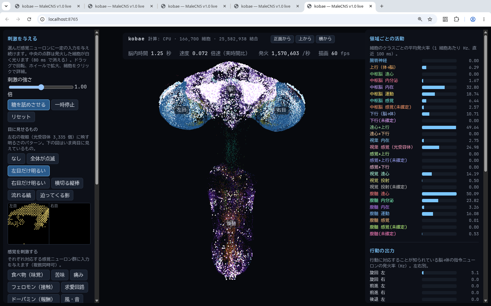

# kobae

ショウジョウバエ（オス）の中枢神経系の全結合図 **MaleCNS v1.0** を、**全 166,700 ニューロン・全 25,582,938 結合**のまま
スパイキングニューロンモデル（LIF）として **Vulkan (wgpu) 上で**シミュレーションし、ブラウザで観察・刺激できるようにしたもの。

- 神経モデルは Shiu et al. 2024 / DoomFly と同じ（dt 0.1 ms、遅延 1.8 ms、不応期 2.2 ms）。DoomFly の CPU カーネルを検算相手にしている
- 対象 GPU は AMD（RX 580 / BC-250 gfx1013）。CUDA は使わない。GPU 側の計算は整数固定小数点で**同じ GPU なら実行ごとにビット単位で再現**する
- 「コバエ」は俗称で、厳密にはショウジョウバエ (*Drosophila melanogaster*) は「コバエ」と呼ばれる小型のハエの一種

設計の経緯と決定は [DESIGN.md](DESIGN.md)、既存実装の評価は [docs/existing-implementations.md](docs/existing-implementations.md)。

## 使い方

```sh
# データ（CC-BY 4.0、Janelia FlyEM + Google Research）を data/malecns_v1/ に置く（3 ファイル、1.1 GB）
#   https://storage.googleapis.com/flyem-male-cns/v1.0/connectome-data/flat-connectome/
#     body-annotations-male-cns-v1.0-minconf-0.5.feather
#     body-neurotransmitters-male-cns-v1.0.feather
#     connectome-weights-male-cns-v1.0-minconf-0.5.feather
uv sync
uv run kobae build                       # feather -> outputs/malecns_v1/graph.npz（sha256 検証つき、15 s）
uv run kobae bench --backend both        # 実時間比の計測（GPU + CPU 参照）
uv run kobae validate --protocol sugar   # GPU と CPU 参照の比較
uv run kobae serve --backend gpu         # http://<host>:8765 でビューア
```

ビューア（`viewer/`）は pnpm プロジェクト。`cd viewer && pnpm install && pnpm build` で `src/kobae/viewer/dist` に出力され、
Python サーバがそれを配信する。開発時は `pnpm dev`（:5173、API は :8765 にプロキシ）。

## 何が見えるか



- **中央**: 体細胞の位置に置いた 166,700 個の点（色 = 細胞のクラス、脳・左目・右目・腹髄のラベルつき）。発火した細胞が白く光る
- **左**: 刺激。糖、目に見せる明るさパターン（点滅・左右・横切る棒・流れる縞・迫る影）、味覚 / 苦味 / 痛み / フェロモン / 求愛 / ドーパミン / 風 / 逃避の各ニューロン群、匂い（ORN を糸球体別に 53 種）、細胞型名で自由指定。速度スライダ（0.1× 〜 4×、最速）
- **右**: 領域ごとの平均発火率、行動の出力（旋回 / 前進 / 後退 / 吻を伸ばす 等の下行・運動ニューロン、左右別）、選んだ細胞群の発火時系列、クリックした細胞の情報

糖受容ニューロン LB3c（23 細胞）を刺激すると吻伸展の運動ニューロン MN9 が 100 Hz 以上で発火する。
これは Shiu et al. 2024 が FlyWire（メス脳）で再現した「糖 → 摂食行動」と同じ現象で、全結合のオス CNS でも出る。

## モデル

| 項目 | 値 | 出典 |
|---|---|---|
| ニューロン | leaky integrate-and-fire、静止 −52 mV、閾値 −45 mV、リセット −52 mV | Shiu 2024 |
| 時定数 | 膜 20 ms、シナプス 5 ms（指数） | 〃 |
| 遅延 / 不応期 | 1.8 ms（18 step）/ 2.2 ms（22 step）、不応期中の到着は捨てる | DoomFly |
| 重み | シナプス数 × 0.275 mV × 符号（ACh +、GABA / glutamate / histamine −、曖昧な 3,718 細胞は既定 +） | 〃 |
| 積分 | dt 0.1 ms、解析解の指数減衰 | 〃 |
| ノード | superclass あり・グリア除外 = 166,700。エッジは両端が retained な全リリース済み結合（閾値なし、自己結合 101 本を含む） | 〃 |

## GPU 実装（`src/kobae/shaders/lif.wgsl`, `src/kobae/gpu.py`）

- 遅延 18 step を 1 バッチにまとめる。t で出たスパイクは t+18 まで誰にも影響しないので、バッチ内の 18 step を 1 thread / neuron のループで積分できる
- バッチごとに `integrate`（全細胞）→ `prep`（indirect dispatch 引数）→ `scatter`（発火 1 つに 1 workgroup、CSR 行を 64 thread で走査し `atomicAdd(int)`）→ `finish`
- シナプス入力は int32 固定小数点（1/10240 mV。0.275 mV = 2816 で誤差ゼロ）。整数加算は可換なので原子加算の順序不定でも決定論的。最悪の同時入力（32,982 mV、実測）に対し 6.4 倍の余裕
- 配送用バッファ（容量 n、毎バッチ再利用）と観測用リング（溢れても配送は欠けない）を分離
- 常駐メモリ: post 102 MB + 重み 102 MB + gin 12 MB + 状態 ~4 MB + リング 16 MB

## 検証（`uv run kobae validate`）

DoomFly の `doom/engine.py` をそのまま numba に移植した CPU 参照（`src/kobae/cpu.py`）と、同じグラフ・同じ刺激で比較。
BC-250（gfx1013）と RX 580 の両方で同じ結果。

| 刺激 | 最初の 20 ms の発火集合 | 発散開始 | 定常状態（最後の 900 ms）総発火数 | 細胞ごとの発火数の相関 | 5 Hz 以上で発火した細胞集合の Jaccard |
|---|---|---|---|---|---|
| 糖 LB3c 30 mV | **完全一致** | 91 ms | GPU / CPU = 0.994 | 0.9992 | 0.93〜（全細胞では 0.93） |
| 全視野 + ラミナ | **完全一致** | 24 ms | 0.9999 | 0.9999 | 0.993 |
| 無入力 | 完全一致（0 発火） | — | 0 / 0 | — | — |

発散は f32 の丸めの差（GPU は固定小数点で加算、CPU は f32 逐次加算）から来る。
同じ CPU 参照でも重みを 1e-7 だけ揺らすと 125 ms で発散するので、これは実装差ではなく系のカオス性。
**糖刺激は双安定**で、0.3〜1.6 s の間 ~20 万 spikes/s で推移したあと ~120 万 spikes/s のアトラクタに跳ぶ。跳ぶ時刻は 1e-6 の摂動で変わるため、統計比較は両者が同じ状態に落ち着いた区間で行う。

## 速度（実時間比 = シミュレーション秒 ÷ 壁時計秒、ロード除く）

`uv run kobae bench`。2 s のウォームアップ後の 2 s を計測。糖は高活動アトラクタに入った状態。

| ホスト | 計算装置 | バックエンド | 無入力 | 糖（120 万 spikes/s、活動 1.7 万細胞） | 全視野視覚（64 万 spikes/s、9.5 千細胞） |
|---|---|---|---|---|---|
| BC-250 | AMD BC-250 APU の GPU（gfx1013、24 CU、GDDR6 382 GB/s） | wgpu / Vulkan (RADV) | **13.4×** | **3.9×** | **10.6×** |
| BC-250 | 同 GPU、視葉 graded 化（段階 2、gather は 9 ms ごと） | wgpu | 1.1× | 0.94× | 0.97× |
| BC-250 | AMD BC-250 の CPU（Zen 2、6 コア、単スレッド） | numba 参照 | — | 0.067× | 0.15× |
| 開発機 | Radeon RX 580（Polaris, 256 GB/s）※事故前の計測、二度と回さない | wgpu | 13.2× | 1.65× | 7.2× |
| 開発機 | Ryzen 7 3700X（単スレッド） | numba 参照 | — | 0.075× | 0.17× |
| 開発機 | Ryzen 7 3700X（単スレッド） | DoomFly C++ カーネル | 22.7× | 0.14× | 0.68× |

- BC-250 の 1 submit（最大 50 バッチ）ごとに完了を待つ安全策込みの数字。待たずに 1 submit で流した場合は 17.9× / 4.2× / 12.6× だった（開発機の事故の原因になった方式なので使わない）
- 糖アトラクタと視覚は結果（発火数・活動細胞数）が RX 580 と BC-250 で**完全に一致**した（同じ f32 演算列なので）
- 参考: Eon Systems の比較表（FlyWire ♀、~500 万結合、糖刺激で活動 ~450 細胞、RTX 4070）は GeNN/CUDA 2.1×、NEST GPU 1.1×、Brian2 CPU 0.37×。グラフが 5 倍大きく活動も 40 倍多い本モデルで BC-250 が 3.9× なので、規模を考えれば同等以上。ただし直接比較ではない
- graded 化の gather（毎回 1,094 万エッジの pull）が支配的。9 ms ごとに間引いて ~1×。活動のある graded 細胞だけ push する方式に変えれば視覚が暗いときはさらに速くなる（未実装）

ビューア経由では 1 フレーム（1/60 s）に「目標速度 × 16.7 ms」分のバッチを回す。

## ディレクトリ

```
src/kobae/      graph.py（feather→CSR）, model.py, cpu.py（参照）, gpu.py + shaders/lif.wgsl, stimulus.py, positions.py,
                server.py（aiohttp + WebSocket）, validate.py, bench.py, cli.py, viewer/dist（ビルド済みフロント）
viewer/         pnpm + vite + three.js（ソース）
docs/           既存実装の評価、スクリーンショット
eval/           既存実装のチェックアウト（git 管理外）
data/, outputs/ 生データと生成物（git 管理外）
body/           flybody（MuJoCo）の体と飛行ポリシー（別 uv プロジェクト、Python 3.12）
```

## 既知の制限

- 視葉（光受容体・ラミナ・メダラ、全体の 6 割）は実際には段階的電位で信号を送るが、現状は全細胞 LIF。段階 2 で CSC（入辺）を使う pull 型カーネルとして graded 化する予定（DESIGN.md）
- 刺激の時間分解能は 1.8 ms（バッチ）単位
- **GPU 実行は BC-250 でのみ行う**。開発機ではデスクトップと GPU を共有していて、1 回の submit が長すぎたときに GPU リセットでデスクトップごと落ちた（DESIGN.md「事故と対策」）
- 体細胞座標が無い 26,062 細胞（16 %、主に体積外の感覚細胞）は結合相手の重心から推定した位置に置いている
- 神経修飾物質（ドーパミン等）は速いシナプスとして +1 扱い（DoomFly と同じ、設定で −1 に変更可）

## 参考・出典

- MaleCNS v1.0: HHMI Janelia FlyEM / Google Research, CC-BY 4.0. https://male-cns.janelia.org/
- Shiu, P. K. et al. "A Drosophila computational brain model reveals sensorimotor processing." Nature (2024)
- DoomFly (MIT): グラフの正規化方針、網膜投影、参照カーネル。https://github.com/nftechie/doomfly
- Eon Systems fly-brain: フレームワーク横断ベンチマーク。https://github.com/eonsystemspbc/fly-brain
- FLYBOARD (MIT): ボタン式刺激の細胞集合の決め方。https://github.com/NullLabTests/flybrain
- flybody (Apache-2.0, Google DeepMind / Janelia): MuJoCo の体と学習済み飛行ポリシー。https://github.com/TuragaLab/flybody
