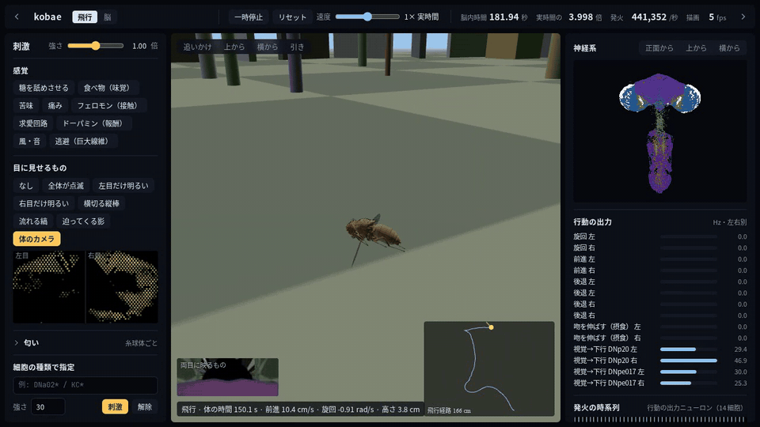
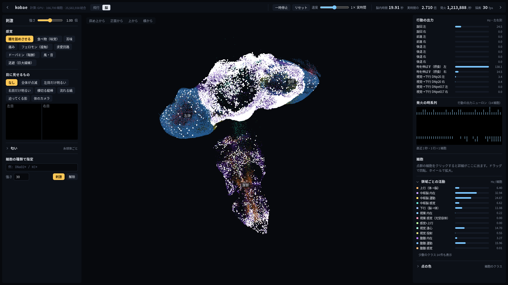

# kobae

ショウジョウバエ（オス）の中枢神経系の全結合図 **[MaleCNS][malecns] v1.0** を、**全 166,700 ニューロン・全 25,582,938 結合**のまま
スパイキングニューロンモデル（LIF）として **Vulkan ([wgpu][wgpu]) 上で**シミュレーションし、ブラウザで観察・刺激できるようにしたもの。

- 神経モデルは [Shiu et al. 2024][shiu2024] / [DoomFly][doomfly] と同じ（dt 0.1 ms、遅延 1.8 ms、不応期 2.2 ms）。DoomFly の CPU カーネルを検算相手にしている
- 対象 GPU は AMD（RX 580 / BC-250 gfx1013）。CUDA は使わない。GPU 側の計算は整数固定小数点で**同じ GPU なら実行ごとにビット単位で再現**する
- 「コバエ」は俗称で、厳密にはショウジョウバエ (*Drosophila melanogaster*) は「コバエ」と呼ばれる小型のハエの一種



（飛行ビュー、約 2 倍速。柱から離陸して降下・旋回しながら飛ぶ 20 秒。脳の出力で操舵される体が主役で、左下が両目に映る映像と状態、右下が飛行経路。脳の点群と行動の出力・発火の時系列は右パネル）

設計の経緯と決定は [DESIGN.md](DESIGN.md)、既存実装の評価は [docs/existing-implementations.md](docs/existing-implementations.md)。

## 使い方

```sh
# データ（CC-BY 4.0、Janelia FlyEM + Google Research）を data/malecns_v1/ に置く（3 ファイル、1.1 GB）
#   https://storage.googleapis.com/flyem-male-cns/v1.0/connectome-data/flat-connectome/
#     body-annotations-male-cns-v1.0-minconf-0.5.feather
#     body-neurotransmitters-male-cns-v1.0.feather
#     connectome-weights-male-cns-v1.0-minconf-0.5.feather
uv sync
uv run kobae build                       # feather -> outputs/malecns_v1/graph.npz（sha256 検証つき、15 s）
uv run kobae bench --backend both        # 実時間比の計測（GPU + CPU 参照）
uv run kobae validate --protocol sugar   # GPU と CPU 参照の比較
uv run kobae serve --backend gpu         # http://<host>:8765 でビューア
```

BC-250 では GPU を LLM のベンチと共有しているので、`gpu-run.sh <label> <cmd...>` 経由で動かす:
llama 系のプロセスと `/tmp/bc250-gpu.lock` が無くなるまで待ってからロックを取り、終了時に外す。
`serve-gpu.sh`（ビューア）と `gpu-bench.sh`（bench + validate）はその薄いラッパー。

ビューア（`viewer/`）は pnpm プロジェクト。`cd viewer && pnpm install && pnpm build` で `src/kobae/viewer/dist` に出力され、
Python サーバがそれを配信する。開発時は `pnpm dev`（:5173、API は :8765 にプロキシ）。
起動時は飛行ビュー（体が主役、脳の点群は右パネル）、上部の「脳」で神経系を大きく表示（選択はブラウザに記憶される）。

## モデル

| 項目 | 値 | 出典 |
|---|---|---|
| ニューロン | leaky integrate-and-fire、静止 −52 mV、閾値 −45 mV、リセット −52 mV | [Shiu 2024][shiu2024] |
| 時定数 | 膜 20 ms、シナプス 5 ms（指数） | 〃 |
| 遅延 / 不応期 | 1.8 ms（18 step）/ 2.2 ms（22 step）、不応期中の到着は捨てる | [DoomFly][doomfly] |
| 重み | シナプス数 × 0.275 mV × 符号（ACh +、GABA / glutamate / histamine −、曖昧な 3,718 細胞は既定 +） | 〃 |
| 積分 | dt 0.1 ms、解析解の指数減衰 | 〃 |
| ノード | superclass あり・グリア除外 = 166,700。エッジは両端が retained な全リリース済み結合（閾値なし、自己結合 101 本を含む） | 〃 |

## GPU 実装（`src/kobae/shaders/lif.wgsl`, `src/kobae/gpu.py`）

- 遅延 18 step を 1 バッチにまとめる。t で出たスパイクは t+18 まで誰にも影響しないので、バッチ内の 18 step を 1 thread / neuron のループで積分できる
- バッチごとに `integrate`（全細胞）→ `prep`（indirect dispatch 引数）→ `scatter`（発火 1 つに 1 workgroup、CSR 行を 64 thread で走査し `atomicAdd(int)`）→ `finish`
- シナプス入力は int32 固定小数点（1/10240 mV。0.275 mV = 2816 で誤差ゼロ）。整数加算は可換なので原子加算の順序不定でも決定論的。最悪の同時入力（32,982 mV、実測）に対し 6.4 倍の余裕
- 配送用バッファ（容量 n、毎バッチ再利用）と観測用リング（溢れても配送は欠けない）を分離
- 常駐メモリ: post 102 MB + 重み 102 MB + gin 12 MB + 状態 ~4 MB + リング 16 MB

## 検証（`uv run kobae validate`）

[DoomFly][doomfly] の `doom/engine.py` をそのまま numba に移植した CPU 参照（`src/kobae/cpu.py`）と、同じグラフ・同じ刺激で比較。
BC-250（gfx1013）と RX 580 の両方で同じ結果。

| 刺激 | 最初の 20 ms の発火集合 | 発散開始 | 定常状態（最後の 900 ms）総発火数 | 細胞ごとの発火数の相関 | 5 Hz 以上で発火した細胞集合の Jaccard |
|---|---|---|---|---|---|
| 糖 LB3c 30 mV | **完全一致** | 91 ms | GPU / CPU = 0.994 | 0.9992 | 0.93〜（全細胞では 0.93） |
| 全視野 + ラミナ | **完全一致** | 24 ms | 0.9999 | 0.9999 | 0.993 |
| 無入力 | 完全一致（0 発火） | — | 0 / 0 | — | — |

発散は f32 の丸めの差（GPU は固定小数点で加算、CPU は f32 逐次加算）から来る。
同じ CPU 参照でも重みを 1e-7 だけ揺らすと 125 ms で発散するので、これは実装差ではなく系のカオス性。
**糖刺激は双安定**で、0.3〜1.6 s の間 ~20 万 spikes/s で推移したあと ~120 万 spikes/s のアトラクタに跳ぶ。跳ぶ時刻は 1e-6 の摂動で変わるため、統計比較は両者が同じ状態に落ち着いた区間で行う。

生物学的な検算として、糖受容ニューロン LB3c（23 細胞）を刺激すると吻伸展の運動ニューロン MN9 が 100 Hz 以上で発火する。
これは [Shiu et al. 2024][shiu2024] が [FlyWire][flywire]（メス脳）で再現した「糖 → 摂食行動」と同じ現象で、全結合のオス CNS でも出る。



（脳ビューで糖を刺激した状態。白く光る点が発火した細胞、右の「行動の出力」で吻を伸ばす MN9 が立ち上がる）

## 速度（実時間比 = シミュレーション秒 ÷ 壁時計秒、ロード除く）

`uv run kobae bench`。2 s のウォームアップ後の 2 s を計測。糖は高活動アトラクタに入った状態。

| ホスト | 計算装置 | バックエンド | 無入力 | 糖（120 万 spikes/s、活動 1.7 万細胞） | 全視野視覚（64 万 spikes/s、9.5 千細胞） |
|---|---|---|---|---|---|
| BC-250 | AMD BC-250 APU の GPU（gfx1013、24 CU、GDDR6 382 GB/s） | [wgpu][wgpu] / Vulkan (RADV) | **13.4×** | **3.9×** | **10.6×** |
| BC-250 | 同 GPU、視葉 graded 化（段階 2、gather は 9 ms ごと） | wgpu | 1.1× | 0.94× | 0.97× |
| BC-250 | AMD BC-250 の CPU（Zen 2、6 コア、単スレッド） | numba 参照 | — | 0.067× | 0.15× |
| 開発機 | Radeon RX 580（Polaris, 256 GB/s）※事故前の計測、二度と回さない | wgpu | 13.2× | 1.65× | 7.2× |
| 開発機 | Ryzen 7 3700X（単スレッド） | numba 参照 | — | 0.075× | 0.17× |
| 開発機 | Ryzen 7 3700X（単スレッド） | [DoomFly][doomfly] C++ カーネル | 22.7× | 0.14× | 0.68× |

- BC-250 の 1 submit（最大 50 バッチ）ごとに完了を待つ安全策込みの数字。待たずに 1 submit で流した場合は 17.9× / 4.2× / 12.6× だった（開発機の事故の原因になった方式なので使わない）
- 糖アトラクタと視覚は結果（発火数・活動細胞数）が RX 580 と BC-250 で**完全に一致**した（同じ f32 演算列なので）
- 参考: [Eon Systems][eon] の比較表（[FlyWire][flywire] ♀、~500 万結合、糖刺激で活動 ~450 細胞、RTX 4070）は [GeNN][genn]/CUDA 2.1×、[NEST GPU][nestgpu] 1.1×、[Brian2][brian2] CPU 0.37×。グラフが 5 倍大きく活動も 40 倍多い本モデルで BC-250 が 3.9× なので、規模を考えれば同等以上。ただし直接比較ではない
- graded 化の gather（毎回 1,094 万エッジの pull）が支配的。9 ms ごとに間引いて ~1×。活動のある graded 細胞だけ push する方式に変えれば視覚が暗いときはさらに速くなる（未実装）

ビューア経由では 1 フレーム（1/60 s）に「目標速度 × 16.7 ms」分のバッチを回す。

## ディレクトリ

```
src/kobae/      graph.py（feather→CSR）, model.py, cpu.py（参照）, gpu.py + shaders/lif.wgsl, stimulus.py, positions.py,
                server.py（aiohttp + WebSocket）, validate.py, bench.py, cli.py, viewer/dist（ビルド済みフロント）
viewer/         pnpm + vite + three.js（ソース）
docs/           既存実装の評価、スクリーンショット
eval/           既存実装のチェックアウト（git 管理外）
data/, outputs/ 生データと生成物（git 管理外）
body/           flybody（MuJoCo）の体と飛行ポリシー（別 uv プロジェクト、Python 3.12）
```

## 体（`body/`、段階 3）

[flybody][flybody]（Google DeepMind / Janelia、Apache-2.0）の [MuJoCo][mujoco] の体と学習済み飛行ポリシーを使う。別の uv プロジェクト（Python 3.12、TensorFlow は重みの抽出にだけ使う）。

```sh
cd body && uv sync
uv run python -m kobae_body.extract_policy ../data/flybody/policies/flight policies/flight.npz   # TF SavedModel -> numpy
uv run python -m kobae_body.loop --brain ws://<gpu-host>:8765/ws --wpg ../data/flybody/wing_pattern_fmech.npy -v
```

- 飛行ポリシー（obs 104 → 256×3 → 12 action、LayerNorm MLP）は翅の拍動パターン生成器と組み合わせて参照軌道を追従する。参照軌道は録画ではなく**指令**（前進速度・旋回角速度・上昇）から逐次生成する
- 脳 → 体: 下行ニューロンの発火率を [DoomFly][doomfly] と同じ流儀で操舵に変換（DNa02 の左右差 → 旋回、DNp09 → 前進、MDN → 後退）。工学的な写像で、生物学的な対応の主張ではない
- 体 → 脳: ハエの目のカメラ画像を R1-R6 の uv マップでサンプリングして輝度にし、`retina` op で脳に送る（脳側は `visual = "external"`）
- ビューアの右パネルにカメラ画像と上から見た飛行経路が出る
- 体の物理は dt 0.2 ms。[flybody][flybody] の task は毎セグメント mjcf を再コンパイル（0.4 s）し毎ステップ mjcf を辿る実装で実時間の 100 倍かかったので、参照配列の in-place 拡張と mujoco 配列への直接書き込みで 1 エピソードを無限に続ける形に変え、**20〜24 倍**まで下げた。閉ループの律速は体（脳は 1× 目標で待っている）
- ポリシーの再実装で踏んだ罠: Acme の `LayerNormMLP` は最初の層だけ LayerNorm + tanh で残りは **ELU**、DMPO の head は `tanh_mean=False`（tanh なし、環境側で [-1,1] にクリップ）、観測 dict は `tree.flatten` で **キーのソート順**に連結。この 3 つを合わせるまで飛ばなかった
- 純粋な視覚入力では DNa02 / DNp09 / MDN（歩行の「生物学的」読み出し）は沈黙する（DoomFly の報告と同じ）。既定の読み出しは DoomFly の BCI モード（DNp20 の左右差 → 旋回、DNpe017 → 前進）。`--mode biological` で切替
- 最初の閉ループでは右の DNp20 が常に強く（L/R ≈ 16/26 Hz）右旋回し続けて円を描いた。原因を切り分けた結果、**コネクトームの左右非対称**: 左右同じ明るさでも DNp20 は R 44 / L 33 Hz（暗闇でも 21 / 10 Hz）。光の方向への応答自体は正しい（左のみ → L 33 / R 22、右のみ → L 1 / R 44）。一様光での発火率を基準として差し引く較正（DoomFly と同じ）を起動時に入れて解消
- ライブ表示は **BC-250 上で体も動かす**（`--body kinematic`、姿勢 = 指令から作る参照軌道、翅は拍動パターン）。実時間の 0.77 倍で動く。[MuJoCo][mujoco] 力学（`--body mujoco`）は 1/13 で、録画・検証用
- ブラウザの飛行ビューは [three.js][threejs]: MuJoCo から書き出したリグ（68 ボディ、25 万三角形、`body/kobae_body/export_rig.py` → `rig.json` + `rig.bin`）を 20 Hz の姿勢ストリームで動かす。目の映像は影・反射なし・自分の体なしで 2 ms/組

### 着地・歩行・離陸（`body/kobae_body/behavior.py`）

視覚入力だけでは歩行・着地系の下行ニューロン（DNa02 / DNp09 / MDN）が沈黙するので、脳の出力だけではハエは永久に飛び続ける。
そこで**工学的な行動の状態機械**を体側に足した（生物学的モデルではない）:
飛行（脳の指令で操舵）→ 前方 2.5 cm 以内に柱があれば 0.4 s で着地（壁に足を付け、頭を上に、翅を畳む）→ 3〜6 s 柱を歩いて登る（三脚歩行の手続き的アニメーション、実測の歩容ではない）→ 0.3 s で離陸して参照軌道を再開。飛行中は高さ 1.5 cm に向けてゆっくり降下する。
ビューアの左下に状態（飛行 / 着地 / 歩行 / 離陸）が出る（冒頭の画像）。

## 既知の制限

- 視葉（光受容体・ラミナ・メダラ、全体の 6 割）は実際には段階的電位で信号を送るが、現状は全細胞 LIF。段階 2 で CSC（入辺）を使う pull 型カーネルとして graded 化する予定（DESIGN.md）
- 刺激の時間分解能は 1.8 ms（バッチ）単位
- **GPU 実行は BC-250 でのみ行う**。開発機ではデスクトップと GPU を共有していて、1 回の submit が長すぎたときに GPU リセットでデスクトップごと落ちた（DESIGN.md「事故と対策」）
- 体細胞座標が無い 26,062 細胞（16 %、主に体積外の感覚細胞）は結合相手の重心から推定した位置に置いている
- 神経修飾物質（ドーパミン等）は速いシナプスとして +1 扱い（[DoomFly][doomfly] と同じ、設定で −1 に変更可）

## 参考・出典

- MaleCNS v1.0: HHMI Janelia FlyEM / Google Research, CC-BY 4.0. https://male-cns.janelia.org/
- Shiu, P. K. et al. "A Drosophila computational brain model reveals sensorimotor processing." Nature (2024). https://doi.org/10.1038/s41586-024-07763-9
- DoomFly (MIT): グラフの正規化方針、網膜投影、参照カーネル。https://github.com/nftechie/doomfly
- Eon Systems fly-brain: フレームワーク横断ベンチマーク。https://github.com/eonsystemspbc/fly-brain
- FLYBOARD (MIT): ボタン式刺激の細胞集合の決め方。https://github.com/NullLabTests/flybrain
- flybody (Apache-2.0, Google DeepMind / Janelia): MuJoCo の体と学習済み飛行ポリシー。https://github.com/TuragaLab/flybody

[doomfly]: https://github.com/nftechie/doomfly
[shiu2024]: https://doi.org/10.1038/s41586-024-07763-9
[malecns]: https://male-cns.janelia.org/
[flywire]: https://flywire.ai/
[eon]: https://github.com/eonsystemspbc/fly-brain
[flybody]: https://github.com/TuragaLab/flybody
[mujoco]: https://mujoco.org/
[wgpu]: https://github.com/pygfx/wgpu-py
[threejs]: https://threejs.org/
[brian2]: https://briansimulator.org/
[genn]: https://genn-team.github.io/
[nestgpu]: https://nest-gpu.readthedocs.io/
